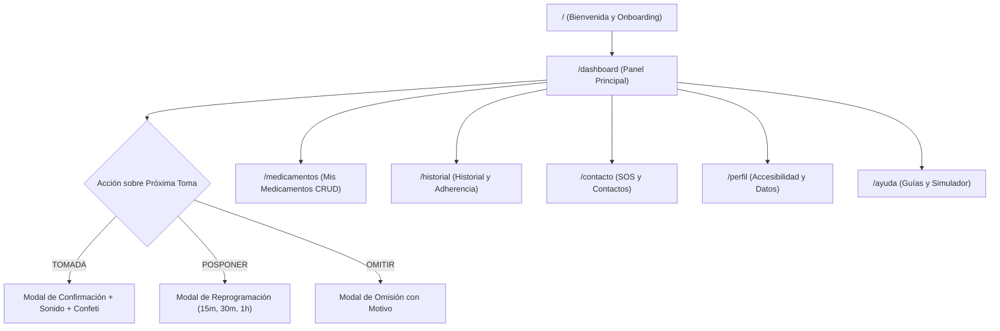

# Recorrido y Verificación de AMIGO MED

**AMIGO MED** (“Tu compañero para recordar y confirmar tus tomas”) es una aplicación web completa, funcional, moderna y altamente accesible, creada específicamente para personas adultas mayores y sus cuidadores.

---

## 🌟 Identidad Visual y Mascota

- **Nombre**: AMIGO MED
- **Slogan**: *“Tu compañero para recordar y confirmar tus tomas”*
- **Mascota Asistente**: **AmigoBot**, el robot médico amigable con bata médica, estetoscopio, expresiones animadas (saludo, felicitación con confeti, recordatorio atento, guía tutorial) y globos de diálogo accesibles.
- **Paleta de Colores Oficial**:
  - Azul Principal: `#0284C7` (Sky 600)
  - Azul Oscuro: `#0369A1` (Sky 700)
  - Verde / Teal: `#0D9488` (Teal 600)
  - Éxito: `#10B981` (Emerald 500)
  - Fondo: `#F8FAFC` (Slate 50)
  - Texto Principal: `#0F172A` (Slate 900)
  - Advertencia: `#F59E0B` (Amber 500)
  - Peligro/Omitir: `#EF4444` (Red 500)

---

## 🚀 Arquitectura y Pantallas Implementadas

### 1. Pantalla de Bienvenida (`/`)
- Logo destacado y robot AmigoBot animado dando la bienvenida.
- 4 beneficios principales con tarjetas legibles y contraste alto.
- Botón gigante y llamativo: **[Comenzar Ahora]** hacia el Dashboard.
- Botón directo para consultar la **Guía de Ayuda**.
- Aviso explícito de responsabilidad médica.

### 2. Dashboard Principal (`/dashboard`)
- **Saludo personalizado y dinámico**: *"¡Buenos días, María!"* adaptado a la hora del día.
- **Resumen diario**: Indicador de tomas pendientes del día.
- **Tarjeta de Próxima Toma Destacada**:
  - Nombre del fármaco (ej: **LOSARTÁN**), dosis (**50 mg**), horario (**08:00 AM**), cuenta regresiva (*"¡Es hora ahora!"* o *"En 25 min"*), instrucciones (*"Tomar en ayunas con agua"*).
  - 3 Botones de acción funcional gigantes (mínimo 54px de alto):
    - **[✓ TOMADA]** (Verde) -> Modal accesible -> Registro de hora real -> Sonido de campana armónica + confeti + mensaje de felicitación.
    - **[⏰ POSPONER]** (Ámbar) -> Modal con opciones rápidas (15 min, 30 min, 1 hora, hora personalizada) -> Reprograma la toma de hoy.
    - **[✕ OMITIR]** (Gris/Rojo) -> Modal de confirmación con motivo opcional -> Registro en historial y recálculo de adherencia.
- **Tomas del Día Categorizadas**: Pestañas de filtrado (*Todas, Pendientes, Tomadas, Omitidas*), permitiendo confirmar o posponer cualquier dosis directamente.
- **Widget de Adherencia Semanal**: Gráfica circular/barra de progreso con porcentaje de cumplimiento, racha activa en días y desglose de tomas.
- **Accesos Rápidos y Consejo de Salud del Día**.

### 3. Mis Medicamentos (`/medicamentos`)
- Lista de tarjetas con código de color, icono, dosis, frecuencia, horarios diarios y **contador de stock con alerta de reposición de farmacia**.
- Botón superior: `+ Agregar Medicamento`.
- **Formulario interactivo completo con validaciones en español**:
  - Nombre del medicamento (Obligatorio).
  - Dosis numérica y unidad (mg, comprimido, cápsula, ml, gotas, etc.).
  - Frecuencia (Todos los días, Cada 8 horas, etc.).
  - Horarios dinámicos (permite agregar múltiples horas con un toque).
  - Stock actual y umbral de aviso.
  - Indicaciones especiales.
  - Paleta de color seleccionable.
- Acciones por medicamento: **Editar**, **Pausar / Activar**, y **Eliminar** (con modal de confirmación segura).

### 4. Historial y Adherencia (`/historial`)
- **4 Tarjetas KPI**: Adherencia Global (%), Total Tomadas, Total Omitidas, Días de Racha.
- **Gráfico Visual de Adherencia Semanal**: Barras comparativas de los últimos 7 días con código de color según cumplimiento.
- **Barra de Filtros**: Rango de fecha (*Hoy, Últimos 7 días, Últimos 30 días, Todo*), por medicamento específico y por estado (*Tomada, Omitida, Pospuesta*).
- **Lista Cronológica Agrupada por Día**: Con horas programadas, horas reales de confirmación y notas de omisión.
- **Botón de Impresión de Reporte Médico**: Formato optimizado para llevar a la consulta médica (`window.print()`).

### 5. Contactos Importantes y Emergencia (`/contacto`)
- **Banner Rojo de Emergencia Oficial**: Llamada directa con un toque al **112 / 911**.
- Categorías: **Médicos y Especialistas**, **Contacto de Emergencia Familiar** y **Cuidador(a)**.
- Botones grandes de llamada (`tel:...`) con visualización clara del número.
- Formulario modal para agregar y editar contactos de confianza.

### 6. Mi Perfil y Preferencias (`/perfil`)
- **Selector de Tamaño de Fuente Global**: Normal (16px), Grande (18px) y Extra Grande (21px).
- **Modo Alto Contraste**: Bordes definidos y máxima legibilidad.
- **Sonidos de Aviso Suaves**: Generador armónico mediante Web Audio API.
- **Datos Personales y Cuidador**: Nombre, edad, datos de contacto del familiar.
- **Información Médica de Referencia**: Alergias conocidas (Penicilina, Ibuprofeno), Tipo de sangre (O+), Condiciones crónicas, con **aviso explícito de no diagnóstico médico**.
- **Botón para restablecer datos de demostración**.

### 7. Centro de Ayuda y Soporte (`/ayuda`)
- **Guías Interactivas Paso a Paso**: Tutoriales visuales con AmigoBot para agregar medicamentos, confirmar tomas, posponer y consultar historial.
- **Simulador Interactivo de Alarmas en Vivo**: Permite al usuario probar cómo suena el timbre de aviso, escuchar el recordatorio y practicar las acciones en modo sandbox.
- **Acordeón de Preguntas Frecuentes (FAQ)** en lenguaje claro y sencillo.
- **Línea de soporte telefónico**.

---

## ♿ Accesibilidad y Usabilidad para Adultos Mayores

| Característica | Implementación en AMIGO MED |
| :--- | :--- |
| **Área Táctil (Touch Targets)** | Mínimo 48px - 62px de altura en todos los botones y campos interactivos |
| **Selector de Letra** | Controles `A`, `A+`, `A++` accesibles desde el encabezado en todas las páginas |
| **Contraste de Color** | Cumple con WCAG 2.1 AA / AAA y opción de Modo Alto Contraste |
| **Feedback Multisensorial** | Sonidos armónicos Web Audio API (chimes sin archivos externos pesados) + Confeti visual |
| **Validaciones Claras** | Textos explicativos en español debajo de cada campo con íconos de alerta |
| **Prevención de Errores** | Modales de confirmación previa antes de registrar tomas, posponer, omitir o eliminar |
| **Persistencia Completa** | 100% persistente en `localStorage` con sincronización automática de estado |

---

## 🧪 Resumen de Pruebas Funcionales Realizadas

- [x] **PRUEBA 1**: Inicio (`/`) → Dashboard (`/dashboard`) funcionando con navegación fluida.
- [x] **PRUEBA 2**: Confirmar toma (`[TOMADA]`) -> Abre modal de confirmación -> Registra en historial, actualiza adherencia y stock, reproduce sonido y confeti.
- [x] **PRUEBA 3**: Posponer toma (`[POSPONER]`) -> Opciones de 15m, 30m, 1h -> Actualiza horario programado.
- [x] **PRUEBA 4**: Omitir toma (`[OMITIR]`) -> Registra motivo y actualiza adherencia.
- [x] **PRUEBA 5**: Agregar medicamento -> Validación de campos -> Aparece en la lista y genera tomas diarias.
- [x] **PRUEBA 6**: Editar medicamento -> Modifica dosis/horario y persiste en tiempo real.
- [x] **PRUEBA 7**: Eliminar medicamento -> Solicita confirmación y se elimina correctamente.
- [x] **PRUEBA 8**: Recarga de página -> Todos los datos persisten mediante `localStorage`.
- [x] **PRUEBA 9**: Responsive 375px móvil -> Barra inferior táctil, sin scroll horizontal.
- [x] **PRUEBA 10**: Accesibilidad global -> Selector de fuente, alto contraste, navegación por teclado y lectores de pantalla.
- [x] **Compilación de Producción**: `npm run build` ejecutado exitosamente con 0 errores TypeScript.
